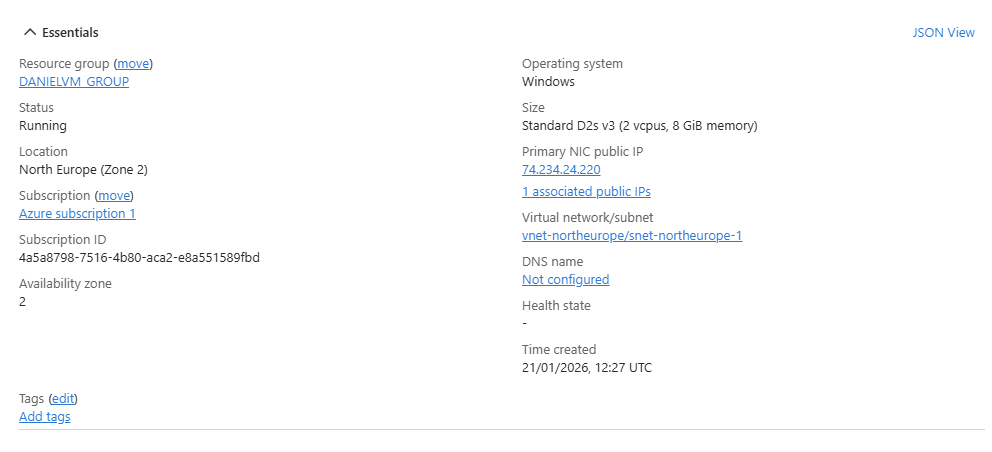
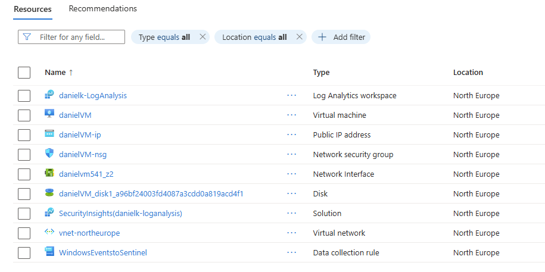
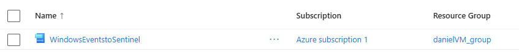
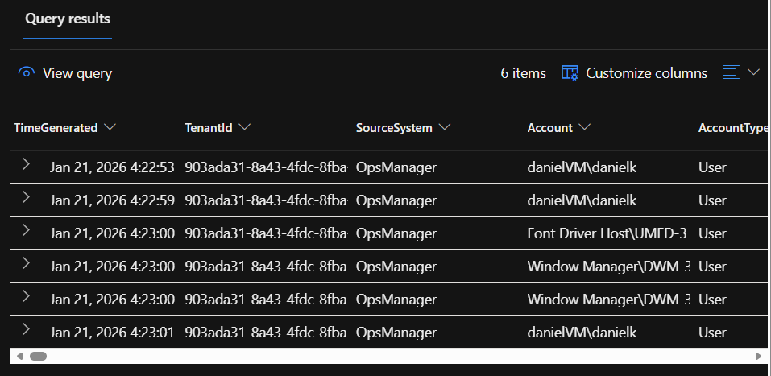
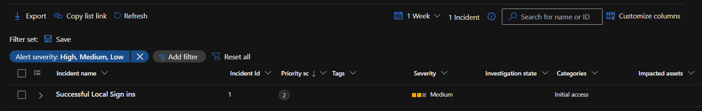
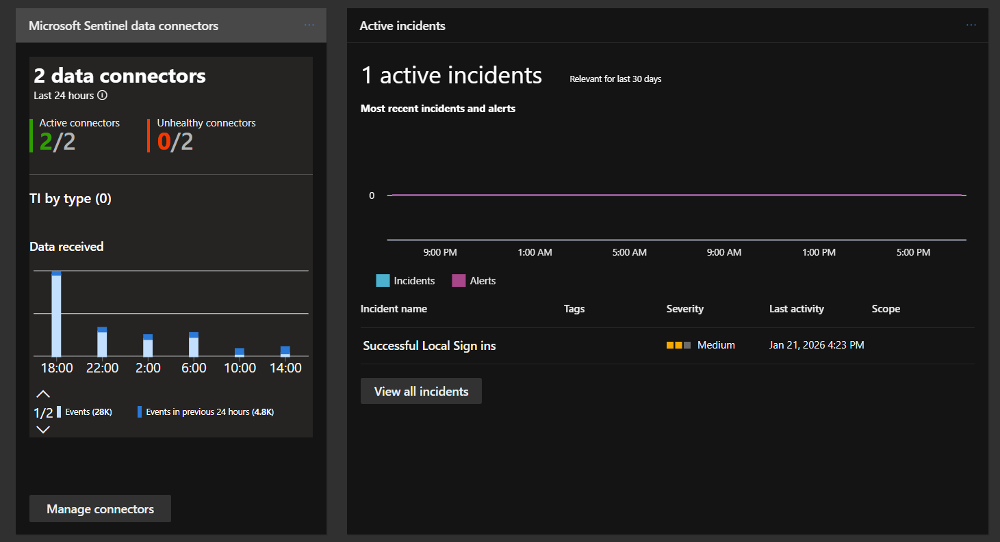

# SOC-SIEM

This project demonstrates a basic Security Operations Center (SOC) built using Microsoft Azure. It ingests Windows security logs into Microsoft Sentinel, creates analytics rules, and visualizes security events using dashboards. The goal is to demonstrate hands-on experience with cloud security monitoring and SIEM concepts.

---

## Architecture 

- Azure Virtual Machine (Windows)
- Log Analytics Workspace
- Microsoft Sentinel (SIEM)
- Azure Monitor Agent
- Custom analytics rules and dashboards

---

## Step Summary

1. Setup and created a Windows Virtual Machine in Azure (VM)
2. Enabled Log Analytics and Azure Monitor Agent
3. Connected Microsoft Sentinel to the workspace
4. Configured security event collection
5. Created analytics rules and dashboards

---

## Detection & Monitoring

- Failed login attempts
- Successful logins
- Security event trends over time

---

## Results 

- Security events successfully ingested into Sentinel
- Alerts triggered when conditions were met
- Dashboards provided visibility into login activity

---

## Screenshots

Below are screenshots demonstrating the deployed SOC components and monitoring capabilities.

### Virtual Machine Overview

### Resource Group

### Data Collection Rule

### Successfull Login Rule and Logic

### Alert Queries

### Inicident Dashboard

### Sentinel Dashboard

---

## Dislaimer

All sensitive information (API keys, credentials, IP addresses, and subscription details) has been redacted.

---

**Author:** [Daniel Krakolinig]  

**Version:** 1.0   

**Last Updated:** February 2026

